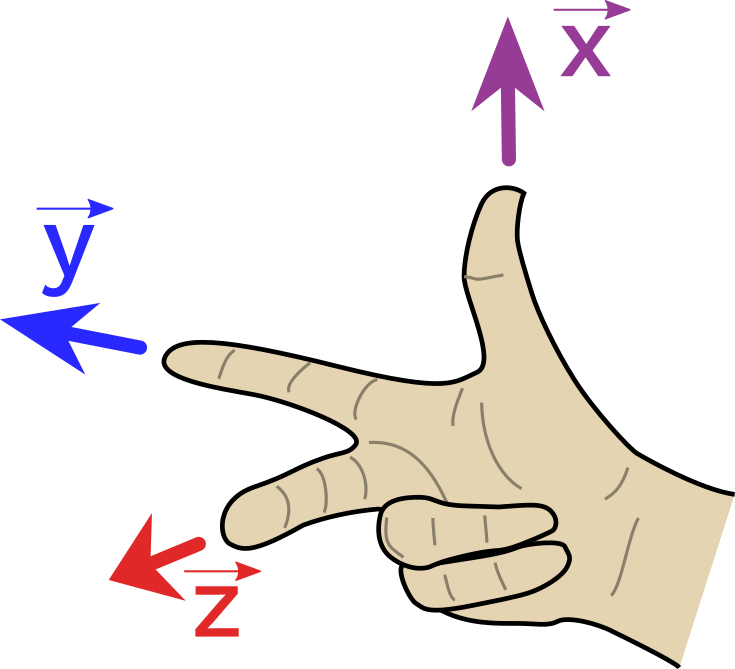
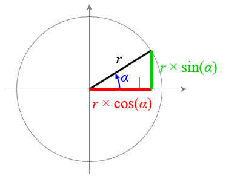
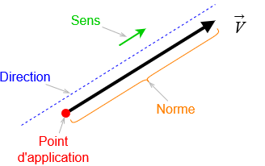
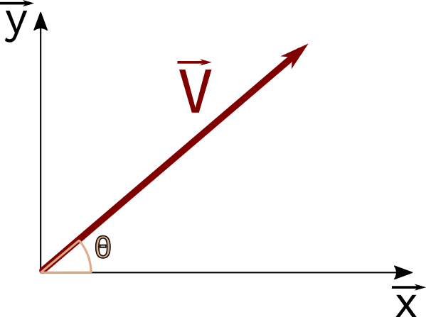

## Bases et Repères

### Base orthonormée directe 
La base **b** ($\vec{x}, \vec{y}, \vec{z}$) est une base orthonormée si les 3 vecteurs $\vec{x}$, $\vec{y}$ et $\vec{z}$ sont :

- unitaires : $\|\vec{x}\| = \|\vec{y}\| = \|\vec{z}\| = 1$
- orthogonaux deux à deux : $\vec{x} \bot \vec{y}$ et $\vec{y} \bot \vec{z}$ et $\vec{z} \bot \vec{x}$

La base b est **directe** si en plus $\vec{x}$, $\vec{y}$ et $\vec{z}$ obéissent à la « règle de la main droite » :

{ width='200' }

#### Vue en 3D de la base (faites tourner en cliquant sur les axes !) :

<iframe loading="lazy" style="border: 0px;" scrolling="no" title="repère3D" src="https://www.geogebra.org/material/iframe/id/qtjtfgbb/width/400/height/400/border/888888/sfsb/true/smb/false/stb/false/stbh/false/ai/false/asb/false/sri/true/rc/false/ld/false/sdz/true/ctl/false" width="300px" height="300px" > </iframe>

----

## Rappel de trigonométrie Trigonométrie
### Mesure d’un angle
Un cercle complet représente un angle de 2π radians.

!!! note
    ** Conversion ** :

    - $360°=2π~rad$
    - $1°= \frac {π} {180}~rad$
    - $1~rad=\frac {180} {π} °$

### Cotés d’un triangle rectangle

Dans un triangle rectangle, on a souvent besoin de pouvoir exprimer la longueur d’un de ses cotés en fonction des autres cotés et d’un de ses angles.

Dans ce cas on peut imaginer un cercle tel que :

- le centre soit sur le sommet du triangle dont on étudie l’angle α
- le rayon r correspond à l’hypoténuse du triangle rectangle

Ainsi, on peut facilement exprimer les deux autres cotés du triangle en fonction de r et de α :

{ width='300' }

---- 

## Les vecteurs
Un **scalaire**, ou élément de l’ensemble des réels R, ne porte qu’une seule information de grandeur physique : température, longueur, pression,...

Un **vecteur** porte un nombre d’informations égal à la dimension de l’espace vectoriel auquel il appartient (souvent trois pour la physique étudiée en cours de SI).

Notations et vocabulaire

!!! note

    Un vecteur est caractérisé par :

    - un point d’application (pour les vecteurs forces et vitesse par exemple)
    - une direction (une droite orientée)
    - un sens (+ ou – sur l’axe défini par la droite orientée)
    - une norme : une valeur positive, dans l’unité de la grandeur physique étudiée

    { width='300' }

Vectoriellement, la direction est donnée par un vecteur directeur $\vec{u}$ et le sens par un signe. On  peut écrire :

$\vec{V} =±V.\vec{u}$

### Écriture cartésienne

Dans une base **b** ($\vec{x}, \vec{y}$), on peut exprimer un vecteur $\vec {V}$ de différentes manières :

- par ses composantes :

$\vec{V} = V_x.\vec{x} + V_y.\vec{y}$

- par ses coordonnées :

$\vec{V} = \begin{pmatrix} V_x \\ V_y \end{pmatrix}_{(\vec{x}, \vec{y})}$

*Remarque : pour écrire un vecteur « en colonne », il faut impérativement préciser la base dans laquelle ses coordonnées sont exprimées.*

## Norme et orientation d'un vecteur
### Norme d'un vecteur
La norme  d'un vecteur se calcule à partir de ses composantes et s'effectue simplement avec le théorème de Pythagore.

$\|\vec{v}\| = \sqrt{v_x^2 + v_y^2}$

<iframe src="https://www.geogebra.org/classic/gtznd4yd?embed" width="800" height="600" allowfullscreen style="border: 1px solid #e4e4e4;border-radius: 4px;" frameborder="0"></iframe>

### Angle d'un vecteur
L'orientation (ou angle) représente l'angle formé  vecteur $\vec{v}$ par rapport à l’axe des abscisses noté 𝜃. 

{ width='300' }

!!! note

    On a :

    $\theta = \widehat{(\vec{v}, \vec{x})}$

### Calcul de l'angle à partir des coordonnées cartésiennes
Pour trouver l'angle à partir des composantes d'un vecteur, on utilise l'identité suivante :

$tan(\theta) = \frac {v_y} {v_x}$

On isole ensuite θ à l'aide de la fonction inverse de la tangente, ce qui donne les deux possibilités suivantes :

!!! note

    **Cas 1** : $V_x > 0$ (le vecteur pointe vers la droite))

 
    $\theta = arctan(\frac {v_y} {v_x})$

    **Cas 2** : $V_x > 0$ (le vecteur pointe vers la gauche))

    $\theta = \pi + arctan(\frac {V_y} {V_x})$

Dans le cas 2, il faut rajouter 180 degrés puisque la fonction arc-tangente ne couvre que des angles de -90° à 90°, ce qui correspond à tous les vecteurs pointant vers la droite. 

## Écriture polaire
Les coordonnées polaires d’un vecteur sont souvent utilisées dans un mouvement non linéaire, par exemple si le mouvement décrit une trajectoire circulaire.

Les coordonnées polaires d’un vecteur $\vec{V}$ définissent sa longueur à partir de l’origine notée 𝑟 et son angle noté 𝜃 , ce qui correspond à sa norme et son angle par rapport à l’axe des abscisses.

<iframe loading="lazy" style="border: 0px;" title="Trigonométrie" src="https://www.geogebra.org/material/iframe/id/S8MjNYYP/width/850/height/680/border/888888/sfsb/true/smb/false/stb/false/stbh/false/ai/false/asb/false/sri/true/rc/false/ld/false/sdz/false/ctl/false" scrolling="no" width="850px" height="680px"> </iframe>

!!! Note
    Il existe un lien entre les coordonnées polaires (𝑟, 𝜃) et les coordonnées cartésiennes $(V_y, V_x)$ d'un vecteur. On a :

    - $V_x = r.cos(𝜃)$
    - $V_y = r.sin(𝜃)$
----

# Opérations vectorielles
## Addition vectorielle
**Calculs en composantes cartésiennes**

$\vec{a} + \vec{b} = (a_x+b_x).\vec{x} + (a_y+b_y).\vec{y} + (a_z+b_z).\vec{z}$

ou

$\vec{a} + \vec{b} = \begin{pmatrix} a_x+b_x \\ a_y+b_y \\  a_z+b_z \end{pmatrix}$

<iframe loading="lazy" style="border: 0px;" title="Somme vectorielle" src="https://www.geogebra.org/material/iframe/id/m7cgsu82/width/410/height/302/border/888888/sfsb/true/smb/false/stb/false/stbh/false/ai/false/asb/false/sri/true/rc/false/ld/false/sdz/true/ctl/false" scrolling="no" width="410px" height="302px"> </iframe>

## Multiplication d’un vecteur par un scalaire

**Calculs en composantes cartésiennes**

$α.\vec{a} = α.a_x.\vec{x} + α.a_y.\vec{y} + α.a_z.\vec{z}$

ou

$α.\vec{a} = \begin{pmatrix} α.a_x \\ α.a_y \\  α.a_z \end{pmatrix}$

<iframe loading="lazy" style="border: 0px;" title="Produit vecteur x scalaire" src="https://www.geogebra.org/material/iframe/id/wmpbfyhm/width/369/height/270/border/888888/sfsb/true/smb/false/stb/false/stbh/false/ai/false/asb/false/sri/true/rc/false/ld/false/sdz/true/ctl/false" scrolling="no" width="369px" height="270px"> </iframe>